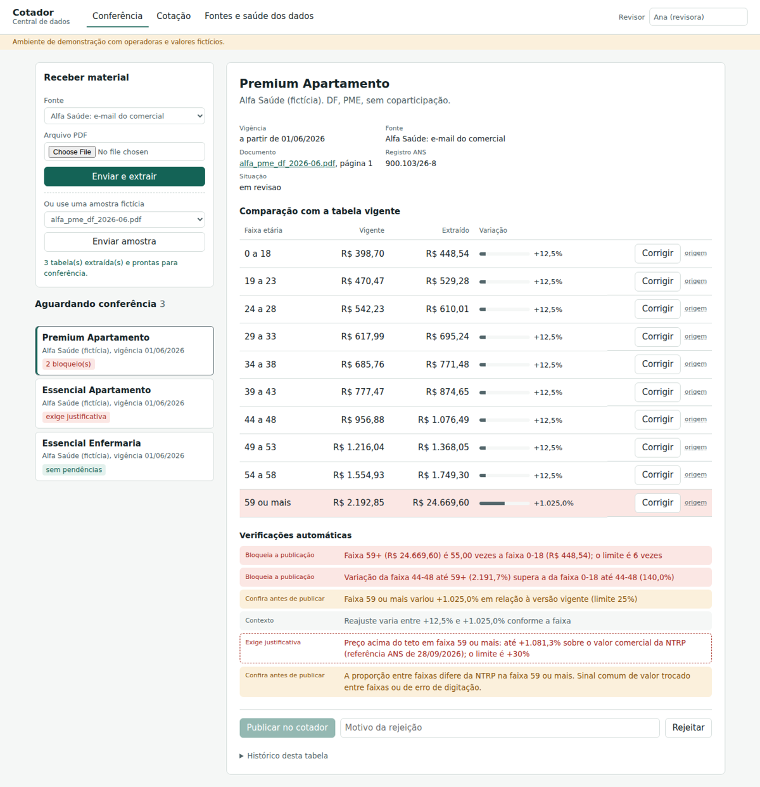
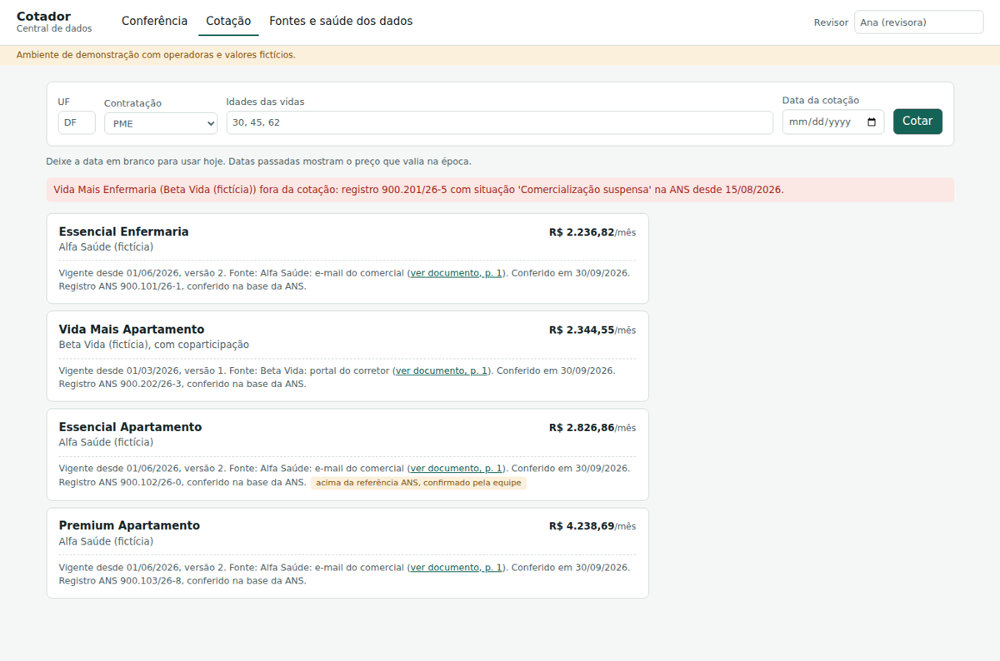

# Cotador: dados de planos de saúde confiáveis e atualizados

Proposta e protótipo para o desafio técnico do Cotador de Planos de Saúde: melhorar a obtenção, a
confiabilidade e a atualização dos dados de preço.

**A tese:** o problema não é digitar menos; é não existir verificação independente do dado. A solução é
uma esteira que extrai as tabelas das operadoras, confere cada uma contra regras da ANS e contra os
dados oficiais de preço publicados pela própria ANS, e só manda para conferência humana o que tem risco.

## Demonstração publicada

**https://cotador-dados-46n1.vercel.app** (abre direto, sem login; funciona no celular)

**Todos os dados são fictícios.** Operadoras, planos, preços e registros ANS (começando com 900) foram
inventados para a demonstração.

### O que você encontra ao abrir

A demonstração já foi usada uma vez, como num dia de trabalho real. Chegou o PDF de reajuste de junho de
uma operadora, com três tabelas, e a equipe conferiu duas:

- **Essencial Enfermaria:** reajuste limpo de 12,5%, publicado com um clique.
- **Essencial Apartamento:** preço 35% acima do valor comercial registrado na ANS (o limite é 30%).
  Publicado com justificativa, que ficou auditada e aparece para o corretor na cotação.
- **Premium Apartamento: ficou para você.** Está na fila de **Conferência**, bloqueado, porque a faixa 59+
  veio com um dígito a mais.

### Em 3 minutos

1. **Cotação:** cote DF, PME, idades `30, 45, 62`. Veja a procedência de cada preço (fonte, vigência,
   versão, link para o PDF original e registro ANS), o plano suspenso pela ANS fora da lista com aviso e a
   etiqueta da liberação justificada. O Premium Apartamento ainda aparece com o **preço de janeiro**: a
   tabela nova não foi aprovada, e o corretor nunca vê um valor não conferido.
2. **Conferência:** preencha o campo **Revisor** e abra o Premium Apartamento. Quatro regras independentes
   apontam o mesmo valor. Clique em **Corrigir** na faixa 59+, digite `2.466,96`, salve e publique.
3. **Cotação de novo:** o Premium Apartamento passa a mostrar o preço de junho.
4. **Fontes e saúde dos dados:** indicadores de qualidade, frescor de cada fonte e a referência ANS.

Para percorrer o fluxo inteiro desde o recebimento do PDF, clique em **Reiniciar demonstração**, no fim da
aba **Fontes e saúde dos dados**, e siga o [roteiro completo](docs/04-roteiro-demonstracao.md). Se a fila
estiver vazia, alguém já corrigiu o Premium Apartamento; o reinício também resolve isso.



## Por onde começar

| Tempo | Documento | Para quem |
|---|---|---|
| 2 min | [`docs/00-resumo-executivo.md`](docs/00-resumo-executivo.md) | Visão de negócio em uma página |
| 3 min | [Demonstração publicada](https://cotador-dados-46n1.vercel.app), seção acima | Ver o sistema funcionando, sem instalar nada |
| 10 min | [`docs/04-roteiro-demonstracao.md`](docs/04-roteiro-demonstracao.md) | Percorrer o fluxo completo, do PDF à cotação |
| 20 min | [`docs/01-proposta.md`](docs/01-proposta.md) | A proposta completa, respondendo às cinco perguntas do desafio na ordem |
| Consulta | [`docs/02-anexo-pesquisa.md`](docs/02-anexo-pesquisa.md) | Método, uso de IA, achados com grau de confiança, pendências e referências |
| Consulta | [`docs/03-deploy.md`](docs/03-deploy.md) | Como a demonstração foi publicada na Vercel |

## O que o protótipo demonstra

O recorte é a parte central da proposta: **tabelas de preço PME**, do PDF recebido até a cotação.

| Situação | O que acontece |
|---|---|
| Reajuste limpo | Extraído, ligado ao registro ANS, validado; publicado com um clique |
| Erro de digitação na faixa 59+ | Quatro regras apontam o mesmo valor (RN 563/2022, variação acumulada, histórico e banda da ANS); só publica depois de corrigido, e a correção fica no histórico |
| Preço 35% acima do valor comercial registrado na ANS | Bloqueado; publicado só com justificativa, que fica auditada e aparece para o corretor |
| Plano com comercialização suspensa pela ANS | Sai da cotação a partir da data da suspensão, com aviso; continua em cotações de datas anteriores |
| Cotação em data passada | Reproduz o preço que valia no dia, com fonte, vigência, versão e link para o original |
| Mesmo PDF enviado de novo | Recusado pelo hash |



## Como executar

### Com Docker (recomendado)

```bash
docker compose up --build
```

- Telas: http://localhost:5173
- API: http://localhost:8000/api/
- Admin do Django: http://localhost:8000/admin/ (crie um usuário com
  `docker compose exec backend python manage.py createsuperuser`)

Na subida, o backend migra o PostgreSQL, gera os PDFs fictícios, sincroniza a referência ANS fictícia e
publica a linha de base. Depois siga o [roteiro de demonstração](docs/04-roteiro-demonstracao.md).

### Sem Docker

```bash
cd backend
python -m venv .venv && source .venv/bin/activate
pip install -r requirements.txt
python manage.py migrate
python manage.py seed_demo          # use --reiniciar para recomeçar do zero
python manage.py runserver
```

Em outro terminal:

```bash
cd frontend
npm install
npm run dev
```

Sem `DATABASE_URL` nem `POSTGRES_HOST`, o backend usa SQLite, útil só para desenvolvimento rápido. A
restrição de vigência no banco existe apenas no PostgreSQL.

### Testes

```bash
cd backend
python -m pytest                               # SQLite: 56 testes, 1 pulado (exclusivo do PostgreSQL)
POSTGRES_HOST=localhost python -m pytest       # PostgreSQL: 57 testes
```

Cobrem as regras de faixa etária, os quatro níveis de validação, a liberação justificada, a
sincronização com a ANS e a reação a suspensões, o descarte de valor inventado pelo extrator LLM (com
cliente simulado), a publicação versionada, a restrição de vigência no banco, a cotação histórica e a
API.

### Outros comandos

```bash
python manage.py avaliar_extracao                  # acerto do extrator contra o gabarito (103/103 campos)
python manage.py avaliar_extracao --metodo llm     # exige ANTHROPIC_API_KEY
python manage.py importar_ans --produtos ARQ_OU_URL --valores ARQ_OU_URL --data-referencia AAAA-MM-DD
```

## O que é real e o que é simulado

| Implementado e testado | Simulado ou fora do recorte |
|---|---|
| Modelo de dados versionado, com vigência e auditoria | Dados das operadoras e da ANS (fictícios) |
| Restrição de exclusão de vigência no PostgreSQL | n8n e RPA de portais (substituídos por upload) |
| Extração determinística de PDF (pdfplumber), com registro ANS | Extrator LLM contra a API real (testado com cliente simulado) |
| Ancoragem: valor que não aparece no documento é descartado | Região de comercialização e comparação entre regiões |
| Validação: estrutura, RN 563/2022, histórico e referência ANS | Autenticação e papéis (API aberta na demonstração) |
| Sincronização da referência ANS por CSV, com reconferência | Fila assíncrona (a extração é síncrona) |
| Liberação justificada da banda de preço | Rede credenciada, carências e coparticipação |
| Vínculo manual do plano ao registro ANS | Alertas por e-mail ou WhatsApp |
| Cotação por data, com procedência e planos suspensos retirados | |
| Painel de frescor e métricas de qualidade | |

## Stack e decisões principais

Django, Django REST Framework, React (Vite), PostgreSQL e Vercel: a stack da empresa, sem forçar
nenhuma peça. As decisões e alternativas estão na seção 5.6 da proposta. As mais importantes:

- **Registro ANS como chave do produto.** É o identificador oficial, presente nas tabelas de venda, na
  rede e nas suspensões; o nome comercial é só rótulo.
- **Nunca sobrescrever.** Cada mudança é uma versão com vigência, e o banco recusa sobreposição.
- **LLM para ler, regras para conferir, humano para decidir.** A ancoragem roda depois de qualquer
  extrator.
- **Humano aprova tudo no início.** A automação total só é liberada por fonte, com acerto medido.

## Uso de IA neste trabalho

Usei o Claude em todo o projeto: na pesquisa, na escrita da proposta e na maior parte do código. Meu
papel foi definir o que construir, decidir entre as alternativas, publicar e testar o sistema no ar.

A confiança no resultado vem das verificações, não da IA. As afirmações sobre regulação têm fonte e grau
de confiança no anexo, o código tem 57 testes rodando em PostgreSQL e o fluxo completo foi usado na
demonstração publicada. Foi assim que encontrei dois defeitos que os testes não pegavam: a correção de um
valor falhava sem avisar, e a tela perdia a comparação depois de publicar uma tabela. Os dois foram
corrigidos. A lista completa do que a revisão encontrou está na seção 1.3 do
[anexo de pesquisa](docs/02-anexo-pesquisa.md).

## API

| Método | Caminho | Descrição |
|---|---|---|
| GET | `/api/` | Situação do serviço |
| GET | `/api/fontes/` | Catálogo de fontes com situação de frescor |
| POST | `/api/documentos/enviar/` | Envia PDF (`arquivo`, `fonte_id`, `metodo` opcional) |
| GET | `/api/documentos/` | Documentos recebidos |
| GET | `/api/documentos/{id}/original/` | Arquivo original |
| GET | `/api/tabelas/?status=em_revisao` | Fila de conferência |
| GET | `/api/tabelas/{id}/` | Detalhe com valores, comparação, validações e auditoria |
| PATCH | `/api/tabelas/{id}/valores/` | Corrige uma faixa (`faixa`, `valor`, `usuario`) |
| POST | `/api/tabelas/{id}/aprovar/` | Publica (`usuario`, `observacao`, `justificativa` se houver bloqueio liberável) |
| POST | `/api/tabelas/{id}/rejeitar/` | Rejeita (`usuario`, `motivo`) |
| GET | `/api/tabelas/{id}/historico/` | Todas as versões da mesma tabela |
| PATCH | `/api/planos/{id}/registro/` | Vincula o plano a um registro ANS (`registro_ans`, `usuario`) |
| GET | `/api/referencia-ans/` | Produtos da referência ANS e sua situação |
| GET | `/api/cotacao/?regiao=DF&tipo=PME&idades=30,45&data=2026-03-10` | Cotação na data, com avisos |
| GET | `/api/metricas/` | Indicadores de qualidade e frescor |
| GET | `/api/amostras/` e `/api/amostras/{nome}/` | PDFs fictícios da demonstração |
| POST | `/api/demo/reiniciar/` | Recria o cenário (só com `DEMO_PERMITE_REINICIAR=1`) |

## Estrutura

```
backend/
  config/                    configurações (DATABASE_URL, Postgres local ou SQLite)
  catalogo/
    models.py                operadora, plano, fonte, documento, tabela versionada, valores, auditoria, referência ANS
    servicos/
      faixas.py              faixas etárias da RN 563/2022
      extracao.py            extratores determinístico e LLM (mesmo schema) e ancoragem
      validacao.py           níveis 1, 2 e 4: estrutura, RN 563/2022, histórico
      referencia_ans.py      nível 3: situação do produto, banda de preço e padrão entre faixas
      sincronizacao_ans.py   importação da referência ANS e reconferência
      ingestao.py            recebe, extrai, liga ao registro ANS e cria tabelas em revisão
      publicacao.py          correção, liberação justificada, publicação versionada, vínculo de registro
      cotacao.py             cotação por data, com procedência e planos suspensos retirados
      demo.py                cenário fictício e reinício
    migrations/0003_...      restrição de exclusão de vigência (PostgreSQL)
    management/commands/     gerar_pdfs_exemplo, seed_demo, importar_ans, avaliar_extracao
    tests/                   57 testes
  amostras/                  PDFs fictícios, gabarito e referência ANS fictícia
frontend/src/                telas de conferência, cotação e fontes
docs/                        resumo, proposta, anexo de pesquisa, deploy e roteiro
```
