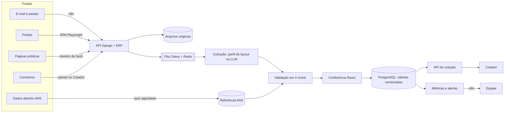
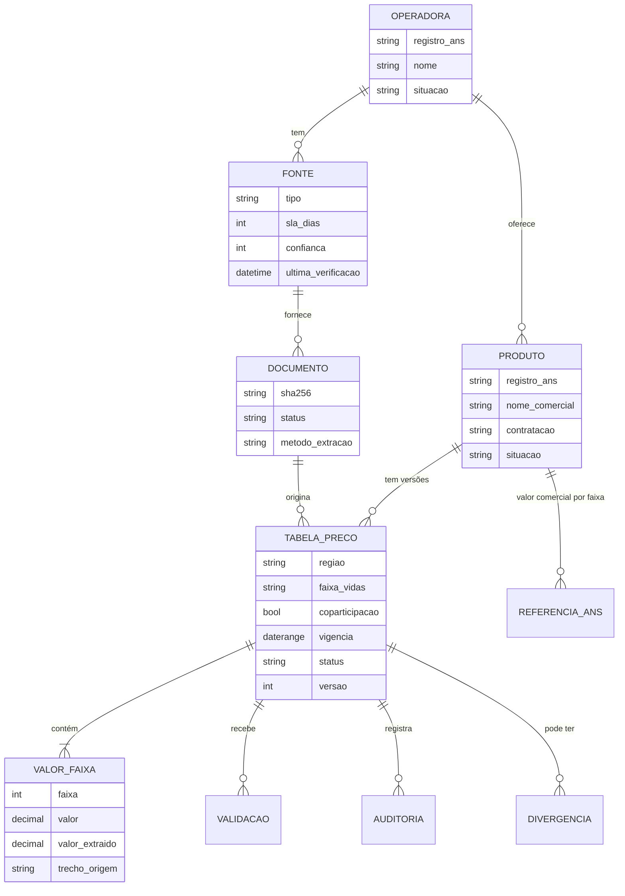

# Proposta: dados confiáveis e sempre atualizados para o Cotador de Planos de Saúde

> Desafio técnico: obtenção, confiabilidade e atualização dos dados do cotador.
> Documentos relacionados: `00-resumo-executivo.md` (uma página), `02-anexo-pesquisa.md` (método,
> achados e fontes), `03-deploy.md` e `04-roteiro-demonstracao.md`.
> As afirmações sobre regulação e mercado têm a fonte indicada entre colchetes e listada na seção 10.
> Números marcados como *estimativa* ou *hipótese* são ordens de grandeza para orientar decisões,
> a serem substituídos por medições reais na fase de descoberta.

---

## Sumário executivo

**O problema real não é digitar menos. É o corretor não conseguir confiar no número que mostra ao
cliente.** Um preço errado apresentado em tempo real queima a credibilidade do corretor diante do
cliente, e o corretor transfere essa desconfiança para o Cotador. Por isso a proposta trata
confiabilidade como produto, não como tarefa de bastidor.

A pesquisa para esta proposta revelou três fatos que mudam a forma de atacar o problema:

1. **O setor já tem uma "espinha dorsal" pública e oficial.** Todo plano regulamentado tem um número
   de registro na ANS, que aparece nas tabelas de venda das operadoras, é obrigatório na divulgação de
   rede credenciada e identifica os planos suspensos [1][11][14]. A ANS publica como dado aberto o
   cadastro de operadoras (inclusive por API), as características dos produtos, a área de
   comercialização, a rede hospitalar por plano e o **valor comercial da mensalidade por faixa etária
   de cada plano** [2][3][4][5].
2. **Existe uma banda oficial de preço.** Os preços praticados na venda precisam ficar dentro de
   limites em torno do valor comercial registrado na nota técnica: no máximo 30% acima e, no mínimo, o
   maior entre a despesa assistencial estimada e 30% abaixo. Além disso, a variação entre as faixas
   etárias da tabela de venda precisa acompanhar a da nota técnica [4]. Isso permite conferir
   automaticamente, com uma fonte independente da operadora, se um preço extraído é plausível.
3. **As regras de faixa etária são verificáveis por máquina.** A RN 563/2022 (que substituiu a RN
   63/2003 com o mesmo texto) impõe três travas objetivas aos preços por faixa, e o STJ definiu como
   calculá-las [6][7][8].

**A solução** é uma esteira de dados com quatro garantias:

- **Origem rastreável:** todo valor aponta para o documento e o trecho de onde veio.
- **Validação automática em quatro níveis:** estrutura, regras regulatórias, cruzamento com dados
  oficiais e consistência histórica.
- **Publicação versionada com vigência:** nada é sobrescrito, e qualquer cotação pode ser reproduzida.
- **Frescor monitorado por fonte:** o sistema sabe quando um dado deveria ter mudado e não mudou.

A automação faz o trabalho repetitivo: receber, ler, extrair, ligar ao registro ANS, validar e comparar.
O humano decide só onde há risco.

**Primeira entrega:** a esteira completa para tabelas de preço PME e adesão das 3 operadoras mais cotadas,
já integrada aos dados da ANS. **Métrica-guia:** percentual de valores publicados sem correção
posterior, junto com o tempo do recebimento à publicação.

---

## 1. Entendimento do problema

### 1.1 Para quem estamos construindo

O corretor usa o Cotador na frente do cliente, muitas vezes pelo WhatsApp, e decide na hora qual
proposta enviar. Três necessidades decorrem disso:

- **O preço precisa estar certo agora.** Não basta estar certo "na próxima atualização".
- **O corretor precisa saber quando confiar.** Um dado antigo sinalizado como antigo é melhor que um
  dado antigo apresentado como atual.
- **A cotação enviada precisa ser defensável depois.** Se o cliente contratar um mês depois e o
  preço tiver mudado, o corretor precisa mostrar o que valia no dia.

### 1.2 O tamanho real do problema

- Há **668 operadoras ativas com beneficiários** no país. As dez maiores concentram 42% dos
  beneficiários [9].
- A Unimed não é uma operadora única: são **cerca de 340 cooperativas** independentes, cada uma com
  suas tabelas e seus canais [9]. Para o Cotador, "Unimed" pode significar dezenas de fontes.
- São **mais de 53 milhões de beneficiários** em planos médico-hospitalares [10]. Os planos
  individuais são só **14,5%** desse total [12]. O coletivo empresarial responde por cerca de **73%**
  dos vínculos [13]. Ou seja: o grosso do mercado do corretor é coletivo (PME e adesão), onde os
  preços não são tabelados pela ANS e mudam por decisão de cada operadora ou administradora.
- O Distrito Federal, mercado da empresa, cresceu **5,95%** em beneficiários em 12 meses até março de
  2026, um dos maiores crescimentos do país [10].

Cada tabela é uma combinação de operadora, produto, área de comercialização, tipo de contratação,
faixa de vidas, coparticipação e acomodação, com 10 valores (um por faixa etária).

*Estimativa ilustrativa:* 30 operadoras × 8 produtos × 10 regiões comerciais × 3 tipos de
contratação × 2 opções de coparticipação resultam em cerca de 14 mil tabelas e 144 mil valores. Com
digitação manual, mesmo uma taxa de erro baixa gera centenas de valores errados publicados.

### 1.3 Tipos de dado e ritmo de mudança

| Dado | Muda com que frequência | Onde costuma estar | Risco se estiver errado |
|---|---|---|---|
| Tabela de preço | Reajustes anuais, campanhas, novos produtos | PDF ou planilha do comercial, portal do corretor, administradora | Muito alto: cotação errada |
| Situação do plano (ativo, suspenso) | Trimestral (monitoramento da ANS) | ANS [14] | Alto: vender plano que não pode ser vendido |
| Rede credenciada | Contínua | Portal da operadora (obrigatório, RN 486/2022) [11], ANS (rede hospitalar) [5] | Alto: cliente descobre depois que o hospital não atende |
| Carências | Raramente (regra de produto) | Material comercial, contrato | Médio |
| Coparticipação e reembolso | Raramente | Manual do produto, condições gerais | Médio |
| Reajuste do agrupamento PME | Anual (maio a abril) | Site da operadora (obrigatório) [15] | Médio: expectativa do cliente |

### 1.4 Causa raiz

Os dois problemas descritos no desafio têm uma causa comum: **não existe verificação independente do
dado**. Hoje a mesma pessoa que lê o material é quem garante que ele está certo, e o erro só aparece
quando um corretor reclama. Automatizar a digitação sem resolver isso só produziria erros mais rápido.
Por isso a proposta começa pela verificação (ANS, regras e histórico) e usa a automação para escalar.

### 1.5 Premissas e dependências

| Premissa | Se não se confirmar |
|---|---|
| A empresa tem ou consegue credenciais de corretor nos portais das operadoras atendidas | Prioriza-se o canal de e-mail comercial, as administradoras e as assessorias |
| Tabelas chegam majoritariamente em PDF ou planilha | Se vierem como imagem, entra OCR, com mais revisão humana no início |
| As tabelas trazem o número de registro ANS do produto (comum no mercado [1]) | A ligação ao registro passa a ser feita na conferência, uma vez por produto |
| Uso de LLM é aceitável para materiais comerciais, sem dados pessoais | O extrator por layout cobre as operadoras principais; LLM fica para exceções |
| Há ao menos uma pessoa da equipe atual para conferir e montar o gabarito inicial | O prazo da primeira entrega aumenta |

---

## 2. Obtenção dos dados

### 2.1 Três camadas de fontes

**Camada oficial (ANS): gratuita, pública, estruturada, mas não traz o preço de venda.**

| Conjunto | O que oferece ao Cotador |
|---|---|
| Operadoras ativas e canceladas (CSV e API JSON) [2] | Cadastro-mestre de operadoras; detectar operadora cancelada |
| Características dos produtos [3] | Cadastro-mestre de planos por registro: segmentação, abrangência, tipo de contratação, situação |
| Valor comercial da mensalidade por faixa etária (NTRP), atualizado semanalmente [4][16] | Banda oficial de preço por plano e faixa; padrão de variação entre faixas |
| Painel de precificação: série mensal de 5 anos [4] | Histórico para detectar saltos atípicos |
| Área de comercialização dos planos [16] | Confirmar que o plano pode ser vendido na região da tabela |
| Rede hospitalar e de urgência por plano [5] | Base oficial da rede hospitalar por produto |
| Solicitações de alteração de rede hospitalar (mensal) [17] | Sinal de mudança de rede para reconferir |
| Planos com comercialização suspensa (trimestral) [14] | Retirar da cotação o que não pode ser vendido |

**Camada comercial (operadoras e administradoras): tem o preço de venda, mas é heterogênea.**
Inclui PDFs e planilhas do comercial, portais do corretor, administradoras de benefícios (no caso dos
planos por adesão) e a página obrigatória de reajuste do agrupamento PME [15].

**Camada de campo (corretores e assessorias): rápida, mas precisa de verificação.** Os corretores
assinantes recebem materiais antes de todo mundo. As assessorias de corretores distribuem tabelas das
operadoras aos parceiros; várias concorrentes do Cotador são justamente assessorias [18].

### 2.2 Catálogo de fontes

Cada fonte é cadastrada com os seguintes campos:

- operadora ou administradora;
- tipos de dado que fornece;
- canal e método de acesso;
- credencial necessária e seu dono;
- frequência esperada de atualização (o SLA de frescor);
- nível de confiança;
- data da última verificação bem-sucedida.

O catálogo transforma o hoje invisível ("depende de um contato interno") em algo gerenciável: fica
claro quais fontes estão atrasadas, quais dependem de uma única pessoa e onde uma parceria teria
mais impacto.

### 2.3 Hierarquia de canais de acesso

Do mais confiável e barato de manter para o menos:

1. **API ou arquivo estruturado por parceria** com operadora, administradora ou assessoria.
2. **Planilha** enviada pelo comercial.
3. **PDF** recebido por e-mail ou baixado de página pública.
4. **Página pública monitorada:** reajuste do agrupamento, rede credenciada e comunicados.
5. **RPA em portal com login** (Playwright), só com credencial legítima da empresa e em ritmo baixo.
6. **Cadastro manual assistido**, para o que não tem canal digital.

A regra prática: cada nível abaixo exige mais manutenção e mais revisão. O objetivo comercial é
subir fontes na hierarquia ao longo do tempo.

### 2.4 Acessos necessários (lista para a fase de descoberta)

- Credenciais de corretor nos portais das operadoras prioritárias, em contas de serviço da empresa e
  não pessoais, guardadas em cofre de segredos.
- Caixa de e-mail dedicada (ex.: `tabelas@...`), cadastrada junto aos comerciais como destinatária
  oficial dos materiais.
- Contato formal com as administradoras de benefícios dos planos por adesão mais cotados.
- Conversa com 2 ou 3 assessorias para avaliar troca de dados, com o argumento de que o Cotador já
  entrega esses dados organizados e validados.

### 2.5 Como acompanhar mudanças

- **Sincronização com a ANS:** cadastro, situação dos planos e valor comercial semanalmente (a
  periodicidade atual do conjunto de valor comercial [16]); rede hospitalar mensalmente; suspensões a
  cada ciclo trimestral. Depois de cada sincronização, os planos afetados são reconferidos.
- **Calendário regulatório:** o reajuste dos planos individuais vale de maio a abril (5,11% para
  2026-2027 [12]), e o reajuste do agrupamento de contratos com menos de 30 vidas também segue o
  ciclo de maio a abril, com divulgação obrigatória no site da operadora [15]. Nessas janelas o
  sistema espera mudanças e cobra as fontes que não se moveram.
- **Monitor de páginas:** as páginas públicas de cada fonte são baixadas periodicamente e comparadas
  por hash. Se mudou, provavelmente há material novo, e abre-se uma tarefa.
- **Entrada contínua:** e-mail e pastas monitorados pelo n8n; tudo que chega entra na esteira.

### 2.6 Fontes indisponíveis ou restritas

- **Degradação explícita.** O dado não some nem finge estar atual: aparece como "sem verificação desde
  dd/mm", e o corretor vê isso na cotação.
- **Triangulação.** Mesmo sem acesso à tabela nova, a banda de valor comercial da ANS mostra se o
  preço exibido continua plausível.
- **Canal do corretor.** O assinante pode enviar o material que recebeu. Esse material entra na mesma
  esteira, com validação e conferência, e o corretor recebe crédito ou aviso quando for publicado.
- **Priorização por demanda.** Com os registros de uso do Cotador, sabe-se quais operadoras e regiões
  mais são cotadas. O esforço de conseguir acesso vai primeiro para onde há mais cotação.

### 2.7 Cuidados legais

Não há regulação específica sobre coleta automatizada de dados no Brasil. Os riscos crescem quando
a coleta envolve dados pessoais, conteúdo atrás de login ou desrespeito aos termos de uso [19][20].
Por isso:

- RPA apenas com credencial legítima da empresa, respeitando os termos de uso e em ritmo que não
  sobrecarregue o portal.
- Nenhum dado de beneficiário é coletado.
- A rede credenciada contém nomes de profissionais, que são dados pessoais. Guarda-se o mínimo
  necessário (nome, especialidade, endereço de atendimento), com a finalidade documentada, conforme
  a LGPD.

---

## 3. Redução do trabalho manual

### 3.1 A esteira

| Etapa | O que acontece | Quem faz |
|---|---|---|
| 1. Recebimento | O arquivo chega por e-mail, upload, RPA ou monitor de página | Automático |
| 2. Registro | O original é guardado imutável com hash; duplicatas são recusadas | Automático |
| 3. Classificação | Identifica operadora, tipo de documento e perfil de layout | Automático, com fila de exceção |
| 4. Extração | Lê valores e metadados, cada valor com o trecho de origem | Automático |
| 5. Ligação | Associa cada tabela ao registro ANS do produto | Automático quando o registro está no documento; humano na primeira vez, se não estiver |
| 6. Validação | Aplica as regras da seção 4 | Automático |
| 7. Conferência | Revisão só do que tem alerta ou erro | Humano |
| 8. Publicação | Nova versão com vigência; a anterior é encerrada | Automático após aprovação |

### 3.2 Extração em camadas

- **Planilhas:** leitura direta, com mapeamento de colunas salvo por fonte.
- **PDF com layout conhecido:** um parser determinístico por "perfil de layout" (pdfplumber). Custo
  zero, previsível e exato. Operadoras costumam repetir o formato, então o esforço de criar o perfil
  se paga rapidamente.
- **PDF com layout novo:** LLM com saída obrigatória em schema (Pydantic). Cada valor precisa vir com
  o trecho literal de onde saiu; valor sem origem é descartado. Após algumas ocorrências do mesmo
  layout, cria-se o perfil determinístico.
- **Verificação de ancoragem, para qualquer extrator:** cada valor extraído precisa aparecer, escrito
  no formato brasileiro, no texto da página de onde diz ter saído. O que não aparece é descartado e vira
  aviso. É uma checagem simbólica barata que pega a falha típica do LLM, o valor plausível que não está
  no documento, sem depender do próprio LLM.
- **PDF escaneado ou imagem:** OCR antes da extração, com revisão integral no início.

**Por que não usar só LLM.** Benchmarks recentes de extração estruturada mostram modelos de ponta com
acerto entre 89% e 98% por campo, mas só de 42% a 77% dos documentos inteiramente corretos [21]. Numa
tabela com dezenas de valores, a chance de haver pelo menos um erro é alta. A qualidade também varia
muito entre ferramentas: num benchmark de 1.000 tabelas complexas, os resultados foram de 64,6 a 90,2
pontos, o que reforça a recomendação de testar com os próprios documentos [22]. Pesquisas mostram
ainda que combinar LLM com verificação simbólica, isto é, regras determinísticas que checam o
resultado, reduz alucinações [23]. É exatamente o desenho proposto: LLM para ler, regras para
conferir e humano para decidir.

### 3.3 Onde e quando o humano entra

| Situação | Ação |
|---|---|
| Qualquer erro de validação | Bloqueia; o revisor corrige o valor ou rejeita o documento |
| Alerta (ex.: variação atípica, fora da banda da ANS) | O revisor confere contra o original e aprova ou corrige |
| Produto ainda não ligado a um registro ANS | O revisor faz a ligação uma vez; nas próximas é automática |
| Layout desconhecido e extração por LLM | Conferência integral nas primeiras ocorrências |
| Tudo passa sem alertas | Na fase inicial, aprovação em um clique, com a comparação à versão anterior na tela |

A tela de conferência mostra lado a lado o documento original (na página certa), os valores
extraídos, a versão vigente e a variação por faixa, com os problemas destacados. O revisor não
relê tudo: olha só o que o sistema marcou.

### 3.4 Quando automatizar mais

A aprovação automática de uma mudança só é liberada quando **todas** as condições abaixo valem:

- a fonte tem histórico medido (ex.: 10 tabelas seguidas sem nenhuma correção humana);
- o layout é conhecido e a extração é determinística;
- a mudança é um reajuste uniforme em todas as faixas;
- todos os valores estão dentro da banda da ANS;
- não há nenhum alerta.

Mesmo assim, uma amostra das aprovações automáticas é conferida por humanos todo mês. Se aparecer
erro, a fonte volta para aprovação manual.

---

## 4. Confiabilidade e atualização

### 4.1 Validação em quatro níveis

**Nível 1: estrutura**

| Regra | Severidade |
|---|---|
| As 10 faixas estão presentes, com valor numérico positivo | Erro |
| Vigência informada e posterior à versão vigente | Erro |
| Metadados obrigatórios (operadora, região, contratação, coparticipação) | Erro |
| Todo valor aparece literalmente no documento (ancoragem) | Valor descartado; vira faixa ausente |
| Operadora do documento coerente com a fonte que o recebeu | Alerta |

**Nível 2: regras regulatórias** (implementadas no protótipo)

| Regra | Severidade | Base |
|---|---|---|
| Valor da faixa 59+ no máximo 6 vezes o da faixa 0-18 | Erro | RN 563/2022, art. 3º, I [6][7] |
| Variação acumulada da 7ª à 10ª faixa não maior que a da 1ª à 7ª, calculada pela razão entre valores e não por soma de percentuais | Erro | RN 563/2022, art. 3º, II; STJ Tema 1.016 [7][8] |
| Nenhuma faixa mais barata que a anterior | Erro | RN 563/2022, art. 3º, III [6][7] |
| Carências dentro dos limites legais: 24 horas para urgência e emergência, 300 dias para parto a termo, 180 dias para os demais casos | Erro | Lei 9.656/98, art. 12, V [24] |

**Nível 3: cruzamento com dados oficiais** (implementado no protótipo, com referência fictícia; a região de comercialização fica para a etapa seguinte)

| Regra | Severidade | Base |
|---|---|---|
| Registro ANS do produto existe e está ativo | Erro | Características dos produtos [3] |
| Plano não está com comercialização suspensa | Erro; se já publicado, sai da cotação com aviso | Monitoramento trimestral [14] |
| A região da tabela está na área de comercialização do plano | Alerta | Área de comercialização [16] |
| Preço de cada faixa dentro da banda do valor comercial da nota técnica | Bloqueio que o revisor pode liberar com justificativa registrada | Limites de comercialização [4] |
| Proporção entre faixas igual à da nota técnica (tolerância de arredondamento) | Alerta | Critério de comercialização da NTRP [4] |

O último item merece explicação. Um preço fora da banda pode indicar:

- erro de extração ou de ligação ao registro (o mais provável);
- nota técnica desatualizada na base da ANS;
- descumprimento regulatório pela operadora (raro).

Por isso ele bloqueia, mas permite liberação justificada. A justificativa fica na auditoria e vira
aprendizado.

**Nível 4: consistência histórica e estatística**

| Regra | Severidade |
|---|---|
| Variação por faixa acima de um limite configurável (ex.: 25%) em relação à versão vigente | Alerta |
| Reajuste não uniforme entre faixas | Informação para o revisor |
| Preço muito diferente do mesmo produto em regiões vizinhas | Alerta |
| Reajuste PME muito distante do percentual do agrupamento divulgado pela operadora [15] | Informação (sinal de contexto, não regra: a tabela de venda nova e o reajuste de contratos existentes são coisas distintas) |

### 4.2 Tratamento de divergências

Quando duas fontes discordam (por exemplo, o PDF do comercial e a tabela enviada por um corretor):

1. Nada é sobrescrito. As duas versões ficam registradas como candidatas.
2. Aplica-se uma ordem de precedência: documento oficial mais recente da operadora ou
   administradora; depois portal; depois material de campo.
3. Se a divergência persistir, abre-se um caso na fila de conferência, com as duas origens lado a lado.
4. A decisão fica registrada com autor, data e motivo, e a fonte perdedora recebe uma marcação que
   alimenta o seu índice de confiança.

### 4.3 Origem, vigência e histórico

- **Linhagem:** cada valor publicado aponta para o trecho, a página e o documento original (guardado
  imutável, com hash), e para a extração e a conferência que o produziram.
- **Vigência:** cada tabela tem início e fim. Ao publicar uma nova versão, a anterior é encerrada na
  véspera. No PostgreSQL, uma restrição de exclusão sobre o intervalo de datas garante que nunca
  existam duas versões vigentes ao mesmo tempo para a mesma tabela.
- **Histórico e auditoria:** extração, correções (de quanto para quanto e por quem), aprovações,
  rejeições e liberações justificadas.
- **Cotação reproduzível:** a proposta enviada pelo corretor guarda a referência das versões usadas.
  Se o cliente questionar depois, é possível mostrar exatamente o que valia no dia da cotação.

### 4.4 Como identificar falhas e dados desatualizados

- **SLA de frescor por fonte**, com painel e alerta quando estoura.
- **Expectativa de calendário:** em maio, por exemplo, espera-se movimento nas fontes de PME e
  individual; fonte parada vira pendência.
- **Mudança detectada em página pública** sem documento novo processado vira tarefa.
- **Evento da ANS:** suspensão, cancelamento ou alteração de rede hospitalar dispara reconferência
  dos planos afetados.
- **Botão "reportar divergência"** na cotação, que abre um caso já ligado à tabela e à versão.
- **Saúde da extração:** documentos com falha, taxa de correção por fonte e tempo parado na fila.
- **Alertas pelo canal da equipe** (e-mail ou WhatsApp), disparados pelo n8n.

### 4.5 Transparência para o corretor

Cada resultado de cotação mostra a vigência, a fonte, a data da última conferência e, quando for o
caso, o aviso de fonte atrasada.

Nenhum concorrente pesquisado destaca a procedência do dado. As ofertas se apoiam em "tabelas sempre
atualizadas" mantidas por equipes internas [18]. Mostrar a procedência é um diferencial de produto,
não só técnico.

---

## 5. Estrutura técnica

### 5.1 Visão geral

### 5.2 Componentes e escolhas

| Componente | Escolha | Por quê | Alternativa considerada |
|---|---|---|---|
| Núcleo e API | Django + DRF | Stack da empresa; admin pronto para operação interna; ORM maduro | FastAPI (menos pronto para back-office) |
| Banco | PostgreSQL | Intervalos de data com restrição de exclusão, JSONB para resultados de extração, índices parciais | Nenhuma relevante |
| Arquivos | S3 (ou disco no início) | Originais imutáveis e baratos | Guardar no banco (pesa o backup) |
| Tarefas assíncronas | Celery + Redis | Extração e RPA fora da requisição, com repetição automática | Fila baseada no próprio banco (mais simples, menos escalável) |
| Entrada e alertas | n8n | Já usado pela empresa; gatilho de e-mail e webhooks sem código | Código próprio para IMAP |
| RPA | Playwright | Estável, headless, grava rastros para depuração | Selenium |
| Extração de PDF | pdfplumber + LLM com schema Pydantic | Determinístico quando possível, LLM quando necessário | Só LLM (seção 3.2) |
| Interface | React | Exigido; tela de conferência rica | Admin do Django (usado como apoio) |
| Deploy | EC2 (API e workers) + Vercel (frontend) | Infraestrutura já usada pela empresa | Contêineres gerenciados |

### 5.3 Modelo de dados

Decisões de modelagem:

- **O registro ANS é a chave natural do produto.** O nome comercial é só um rótulo, e os apelidos
  ("SulAmérica" e "Sul America") ficam numa tabela à parte.
- **Guardam-se dois valores por faixa:** o extraído e o publicado. A diferença entre eles mede a
  qualidade da extração sem esforço extra.
- **As validações ficam gravadas como resultado**, não só calculadas na hora. Assim se sabe com
  quais regras cada versão foi aprovada.

### 5.4 Crescimento

- **Idempotência:** o hash do documento e a chave da tabela impedem duplicidade, mesmo com
  reprocessamento.
- **Particionamento por operadora** nas filas: uma fonte problemática não trava as outras.
- **Custo de LLM decrescente:** cada layout que se repete vira perfil determinístico.
- **Leitura rápida:** a cotação consulta só versões publicadas, com índice por região, contratação e
  vigência. É possível cachear por região, porque os preços mudam raramente.
- **Gargalo humano visível:** a fila mostra quantas tabelas aguardam e há quanto tempo. É esse
  indicador, e não a capacidade técnica, que dita o ritmo de expansão para novas operadoras.

### 5.5 Segurança

- Credenciais de portais em cofre de segredos, em contas de serviço, com dono definido por fonte.
- Papéis separados na interface interna: quem envia, quem confere e quem administra.
- Nenhum dado de beneficiário no pipeline de dados.
- Dados de profissionais da rede credenciada tratados com minimização.

### 5.6 Registro de decisões

| Decisão | Alternativa | Por que esta |
|---|---|---|
| Versionar com vigência, nunca sobrescrever | Atualizar o registro existente | Histórico, auditoria e cotação reproduzível |
| Registro ANS como chave do produto | Nome comercial | Identificador oficial, presente nas tabelas, na rede e nas suspensões |
| Validar contra dados da ANS antes de publicar | Confiar apenas no documento da operadora | Verificação independente é o que falta hoje |
| Humano aprova tudo no início | Publicar automaticamente o que passa na validação | Sem acerto medido, automação total é aposta |
| Extração em camadas | Só LLM | Custo, previsibilidade e dados de benchmark |
| Bloqueio com liberação justificada para a banda da ANS | Apenas alertar | O preço fora da banda é quase sempre erro nosso; a justificativa documenta a exceção |
| Recorte inicial em preços | Preço, rede e regras juntos | Dado mais crítico e mais mutável |
| Verificação de ancoragem após qualquer extrator | Confiar no trecho informado pelo LLM | O LLM pode inventar o trecho junto com o valor; o texto do PDF não |
| Restrição de exclusão de vigência no PostgreSQL | Só a regra na aplicação | A aplicação pode ter bug ou concorrência; o banco é a última defesa |
| Demonstração publicada na Vercel com Postgres gerenciado | EC2 desde já | Link de teste em minutos e sem custo; produção continua em EC2 para os workers (ver `03-deploy.md`) |

---

## 6. Plano de implementação

### 6.1 Fase 0: descoberta (2 semanas)

- Inventário de fontes atuais, canais e acessos, para preencher o catálogo.
- **Linha de base:** tempo médio por tabela hoje, erros encontrados após publicação nos últimos
  meses, idade média dos dados e reclamações de corretores.
- Ranking de operadoras e regiões por volume de cotação, a partir dos registros de uso.
- Gabarito: 20 a 30 tabelas reais conferidas manualmente, para medir a extração.
- Prova de conceito da ligação com a ANS: baixar os conjuntos de produtos e de valor comercial e
  verificar, nas tabelas atuais, quantas se ligam automaticamente a um registro.

### 6.2 Primeira entrega (semanas 3 a 8)

- Esteira completa para tabelas de preço PME e adesão das 3 operadoras mais cotadas.
- Sincronização com a ANS: produtos, situação, suspensões e banda de valor comercial.
- Tela de conferência, publicação versionada e procedência visível na cotação.
- Painel de frescor e métricas.
- Entrada por e-mail via n8n.

### 6.3 Próximas etapas

| Etapa | Conteúdo | Quando (*hipótese*) |
|---|---|---|
| 2 | Mais 5 a 10 operadoras; perfis de layout; monitor de páginas públicas; canal do corretor | Meses 3 e 4 |
| 3 | Rede hospitalar via ANS; rede credenciada via portais; carências e coparticipação | Meses 4 a 6 |
| 4 | RPA nos portais prioritários; aprovação automática com critérios; cotação reproduzível na proposta | Meses 6 a 9 |
| 5 | Parcerias de dados com operadoras, administradoras e assessorias | Contínuo, desde a fase 0 |

### 6.4 Métricas de sucesso

| Métrica | O que mede | Meta (*hipótese*, ajustar após a linha de base) |
|---|---|---|
| Tempo do recebimento à publicação | Eficiência | Queda de 70% |
| Valores publicados que precisaram de correção depois | Qualidade final | Menos de 0,1% |
| Valores aceitos sem edição na conferência | Qualidade da extração | Acima de 95% nas fontes com perfil de layout |
| Idade média do dado e fontes fora do SLA | Frescor | Nenhuma fonte prioritária fora do SLA |
| Divergências reportadas por corretores | Confiança percebida | Queda mês a mês |
| Produtos cobertos e ligados ao registro ANS | Escala | Crescimento sem aumento da equipe |

**Acompanhamento pós-entrega:** revisão quinzenal das métricas nos primeiros 3 meses, com conversa
com 5 corretores ativos por mês sobre a confiança nos dados. Se a taxa de correção de uma fonte subir,
ela volta para conferência integral.

### 6.5 Riscos e mitigação

| Risco | Probabilidade | Mitigação |
|---|---|---|
| LLM inventar ou trocar valores | Média | Schema, trecho de origem obrigatório, 4 níveis de validação, conferência, gabarito |
| Operadora mudar o layout do PDF | Alta | Falha de extração vira alerta; o LLM cobre enquanto o perfil é atualizado |
| Tabelas sem registro ANS | Média | Ligação manual única por produto, reaproveitada depois |
| Dados da ANS com defasagem | Média | A banda bloqueia com liberação justificada; a data da referência é exibida ao revisor |
| Termos de uso e bloqueio de robôs | Média | Priorizar e-mail e parcerias; RPA só com credencial legítima e em ritmo baixo |
| Dependência de credenciais pessoais | Alta hoje | Contas de serviço, cofre e dono por fonte |
| Custo de LLM | Baixa | Perfis determinísticos para layouts repetidos |
| Resistência da equipe à nova ferramenta | Média | A equipe atual monta o gabarito e define a tela de conferência junto |

### 6.6 Limitações assumidas

- A ANS não publica o preço de venda, só a referência da nota técnica. A banda de 30% valida a
  plausibilidade, não o valor exato.
- A nota técnica só existe para planos médico-hospitalares com preço preestabelecido [4].
- Planos em que só a operadora tem o dado, sem canal digital, continuarão dependendo de
  relacionamento. A proposta torna essa dependência visível e mensurável, mas não a elimina.

---

## 7. Protótipo

O protótipo demonstra a parte central da proposta para tabelas de preço PME, com operadoras e registros
fictícios. O roteiro completo está em `04-roteiro-demonstracao.md`. Em resumo:

- o PDF de reajuste é recebido, extraído, ligado ao registro ANS de cada plano e validado nos quatro níveis;
- um erro de digitação plantado é pego por quatro regras independentes e só sai com correção, que fica
  registrada;
- um preço 35% acima do valor comercial da nota técnica é bloqueado e só é publicado com justificativa
  auditada, que o corretor vê na cotação;
- a publicação cria uma nova versão e encerra a vigência da anterior; o PostgreSQL recusa sobreposição;
- um plano suspenso pela ANS sai da cotação a partir da data da suspensão, mas continua em cotações de
  datas anteriores;
- a cotação por data mostra procedência, vigência, versão, link para o original e registro ANS;
- o painel de saúde dos dados mostra aceite sem correção, fontes atrasadas e liberações justificadas.

**Real:** modelo de dados versionado, restrição de exclusão de vigência no PostgreSQL, extração
determinística com pdfplumber, verificação de ancoragem, validações dos níveis 1 a 4 (exceto região de
comercialização e comparação entre regiões), sincronização da referência ANS a partir de CSV,
liberação justificada, conferência, cotação histórica, métricas e 57 testes automatizados, rodados em
PostgreSQL 16.

**Simulado ou fora do recorte:** dados das operadoras e da ANS (fictícios, no formato de trabalho
descrito em `02-anexo-pesquisa.md`); n8n e RPA (substituídos por upload); extrator LLM (testado com
cliente simulado, inclusive o descarte de valor inventado, mas não contra a API real); autenticação e
papéis; fila assíncrona (extração síncrona); rede credenciada, carências e coparticipação.

Instruções de execução no README.

---

## 8. Glossário

- **ANS:** Agência Nacional de Saúde Suplementar, reguladora do setor.
- **Registro ANS do produto:** número que identifica oficialmente cada plano.
- **NTRP:** Nota Técnica de Registro de Produto, documento atuarial que justifica o preço do plano e
  informa o valor comercial por faixa etária.
- **Agrupamento de contratos ("pool de risco"):** conjunto dos contratos coletivos com menos de 30
  vidas, que recebem um percentual único de reajuste por operadora [15].
- **Administradora de benefícios:** empresa registrada na ANS que contrata e gerencia planos
  coletivos, especialmente por adesão.
- **Vigência:** período em que uma tabela de preço vale para novas vendas.
- **Banda de comercialização:** faixa de preço permitida em torno do valor comercial da NTRP.
- **Ancoragem:** checagem de que cada valor extraído aparece literalmente no documento de origem.

## 9. Próximos passos imediatos

1. Validar esta proposta com a equipe que hoje cadastra os dados.
2. Levantar a linha de base (seção 6.1).
3. Baixar os conjuntos da ANS, confirmar a chave de junção entre eles e medir quantas tabelas atuais
   se ligam a um registro.

## 10. Referências

1. Tabela de preços Notredame Intermédica com registro ANS por produto (exemplo de mercado): https://da-arquivos.webhostusp.sti.usp.br/arquivos/auxilio-saude/Notredame/Demonstrativo_Reajuste_Notredame_-_Set25_-_Mai26.pdf
2. ANS disponibiliza API para os conjuntos de operadoras ativas e canceladas: https://legismap.com.br/conteudos/artigos-e-noticias/noticias-ans-em-15-09-2021
3. ANS, relatório do Plano de Dados Abertos (lista de conjuntos): https://www.gov.br/ans/pt-br/arquivos/acesso-a-informacao/perfil-do-setor/dados-abertos/pda-edicao-2017-2019/relatorio_final_pda_2017-2019.pdf
4. Portal de Dados Abertos: Painel de Precificação, Valor Comercial por Município e Valor Comercial da Mensalidade por Faixa Etária (NTRP), com os limites e critérios de comercialização: https://dados.gov.br/dataset/painel-de-precificacao e https://dados.gov.br/dataset/valor-comercial-medio-por-municipio-ntrp e https://dados.gov.br/dataset/valor-comercial-da-mensalidade-por-faixa-etaria
5. Portal de Dados Abertos: Produtos e Prestadores Hospitalares: https://dados.gov.br/dataset/produtos-e-prestadores-hospitalares
6. Texto da RN 63/2003, com o inciso III incluído pela RN 254/2011: https://www.legisweb.com.br/legislacao/?id=99845
7. RN 563/2022 sucede a RN 63/2003, em vigor desde 01/02/2023: https://calculacentro.com/blog/plano-saude-faixas-etarias-ans-reajuste e https://www.migalhas.com.br/depeso/457714/reajuste-por-idade-em-plano-de-saude-validades-e-cream-skimming
8. STJ, Tema 1.016 (REsp 1.716.113/DF), cálculo da variação acumulada: https://informativos.trilhante.com.br/julgados/stj-resp-1716113-df
9. Conjur, "Brasil tem 668 operadoras de plano de saúde e 53 milhões de beneficiários" (jun/2026): https://www.conjur.com.br/2026-jun-12/brasil-tem-668-operadoras-de-plano-de-saude-e-53-milhoes-de-beneficiarios/
10. ANS, números de beneficiários de março de 2026: https://www.gov.br/ans/pt-br/assuntos/noticias/numeros-do-setor/ans-divulga-numeros-de-beneficiarios-em-marco
11. Divulgação da rede assistencial no portal da operadora, por plano identificado pelo registro: exigência criada pela RN 285/2011 (https://idec.org.br/consultas/dicas-e-direitos/planos-de-saude-devero-mostrar-mapa-com-rede-credenciada-em-seus-sites-saiba-como-vai-funcionar) e hoje consolidada na RN 486/2022 (https://legismap.com.br/conteudos/artigos-e-noticias/alerta-regulatorio-orizon-31-03-2022)
12. Reajuste de planos individuais 2026-2027 e participação dos individuais: https://mercadoeconsumo.com.br/03/06/2026/servicos/numero-de-beneficiarios-de-planos-de-saude-sobe-em-abril-para-52958-milhoes-diz-ans/
13. Participação do coletivo empresarial nos vínculos: https://www.em.com.br/mundo-corporativo/2026/07/7469968-planos-de-saude-superam-53-milhoes-de-beneficiarios.html
14. Monitoramento da Garantia de Atendimento e suspensões por registro de produto: https://portal.afya.com.br/saude/ans-suspende-comercializacao-de-70-planos-de-saude-outros-40-foram-reativados
15. RN 565/2022, agrupamento de contratos e divulgação obrigatória (exemplos): https://www.unimed.coop.br/site/web/dourados/agrupamento-de-contratos-coletivos e https://www.unimed.coop.br/site/web/litoralsul/rn-565
16. ANS atualiza os conjuntos de área de comercialização e valor comercial por faixa, que passou de mensal para semanal: https://www.gov.br/ans/pt-br/assuntos/noticias/sobre-ans/ans-atualiza-dois-conjuntos-de-dados-abertos
17. Conjunto mensal de solicitações de alteração de rede hospitalar: https://legismap.com.br/conteudos/artigos-e-noticias/noticias-ans-em-26-04-2021
18. Concorrentes: https://agger.com.br/produtos/painel-do-corretor/ , https://www.simuladoronline.com/ , https://www.baeta.com.br/solucoes/saude
19. Demarest, "Web scraping: legal ou ilegal": https://www.demarest.com.br/wp-content/uploads/2022/01/Web-scraping-legal-ou-ilegal-1.pdf
20. Web scraping e LGPD: https://jus.com.br/artigos/87950/web-sscraping-na-lei-geral-protecao-de-dados-pessoais
21. Real-Time Trustworthiness Scoring for LLM Structured Outputs and Data Extraction (arXiv 2603.18014): https://arxiv.org/pdf/2603.18014
22. Resultados do RD-TableBench: https://llms.reducto.ai/table-extraction-accuracy-scanned-pdfs
23. Verificação simbólica para reduzir alucinação em tabelas geradas por LLM (arXiv 2508.09324): https://arxiv.org/pdf/2508.09324v1.pdf
24. Lei 9.656/1998, art. 12, V: https://www.legjur.com/legislacao/art/lei_00096561998-12
